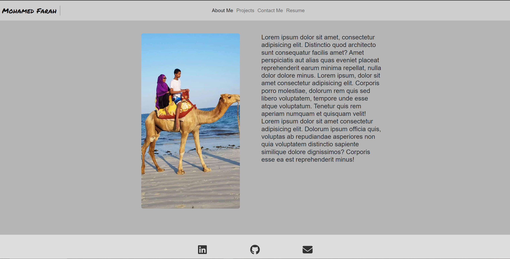
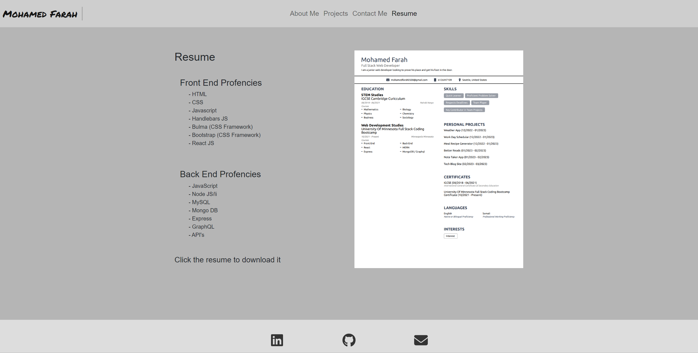
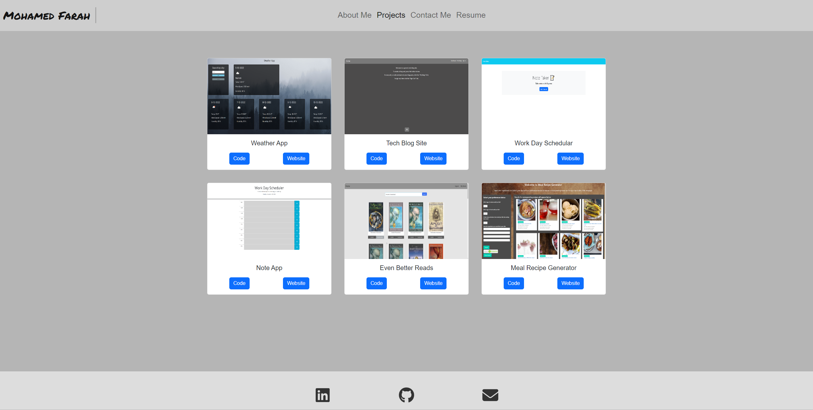
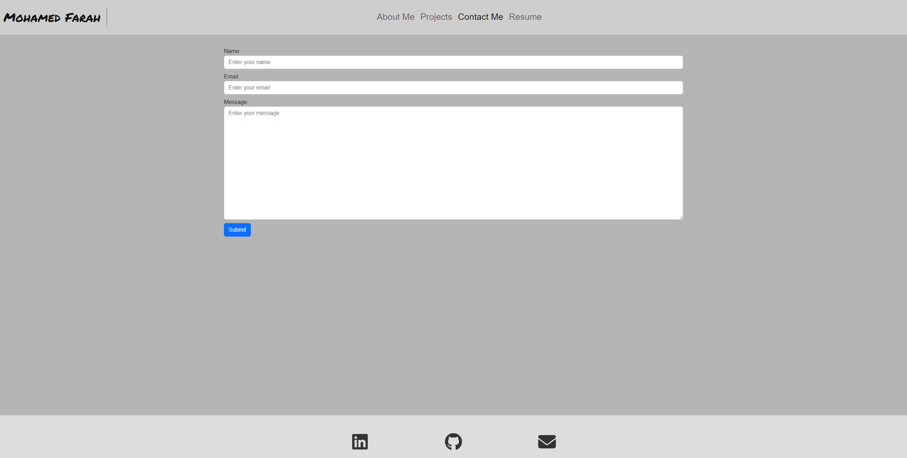

# react-portfolio 

# Description

This project is a portfolio containing an about me page, a message page, a projects page, and a resume page.
This site was created using react, styled with bootstrap, and utilizes conditional rendering.

- Below are images of the portfolio website in use.

  

  

  

  

## Table of Contents

- [Installation](#installation)
- [Usage](#usage)
- [Credits](#credits)
- [License](#license)

# Installation

No need for installations.

# Usage

Open the website [here](https://moxamadfarax.github.io/react-portfolio/) and go off.

# Contributors

I am currently the lone contributor.

# License

This project uses the MIT license.

# Tests

There are currently no tests for this application so far.

# Questions

Contact me at mohamedfarah0508@gmail.com for any questions.
